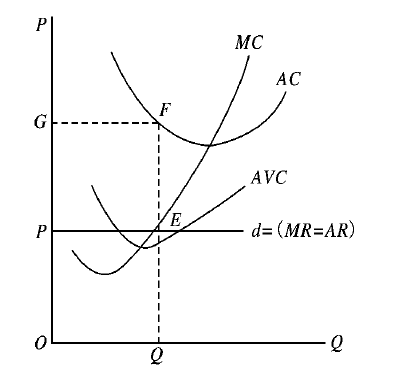

# Principle of  Economy HW4

##### 106033233 資工21 周聖諺

### 1.
> ### 為何 MC 一定通過 ATC 的最低點?

可以假設兩種狀況來分析

(1) 當MC>ATC：當新增單位生產成本量(MC)逐漸增大且比既有平均成本量(ATC)還大時，只會使得既有量越來越大，會逐漸拉高平均生產成本。

(2) 當MC<ATC：當新增單位生產成本量(MC)逐漸增大但比既有平均成本量(ATC)還小時，只會使得既有量越來越小，會逐漸降低平均生產成本。

因此，MC與ATC必定會交會在最低點，因為任何MC不等於ATC的狀況都會使兩邊往ATC的最低點交會。

### 2.
> ### 在短期時，哪一部分的供給曲線，對應廠商處於虧損狀態? 為何廠商會在承受虧損下繼續營業或生產?

當邊際收益(MR)與邊際成本(MC)相交在邊際成本(MC)低於平均成本(AC)之處，即完全競爭條件下供給大於需求時廠商的短期均衡時，廠商的總收入(PEQO)少於總成本(GFQO)，會導致廠商虧損。

但在此時，在市場價格(P=MC=MR)高於平均變動成本(AVC)時，廠商繼續生產可以減少虧損，不無小補，若不生產因仍要支付固定成本，反而無法彌補虧損，所以廠商有可能選擇繼續生產。但如果市場價格(P=MC=MR)低於平均變動成本(AVC)時，多生產的單位連變動成本都無法彌補，就更不可能抵銷平均固定成本(AFC)了，所以就應該停止生產。

### 3.
> ### 在長期均衡時，廠商的產量會落在供給曲線的哪一點上? 此時的經濟利潤應該是多少? 會計利潤應該是多少?

在長期均衡狀態下，廠商的超額利潤為零。廠商的長期均衡條件為：MR=LAC(Long Average Cost即LRATC)=SAC

因在長期廠商可針對市場需求調整生產規模並決定進入或對出市場，同時因經過長期調整，所以不會以超額利潤或損失存在，所以廠商的產量會落在短期平均成本曲線(SAC)之最低點的產量，而且也必然是長期平均成本曲線(LAC)之最低點的產量。

也因上面的推論，經濟利潤為零(因沒有超額利潤)，會計利潤則為總收益減總成本TR-TC=(AR-AC)*Q。